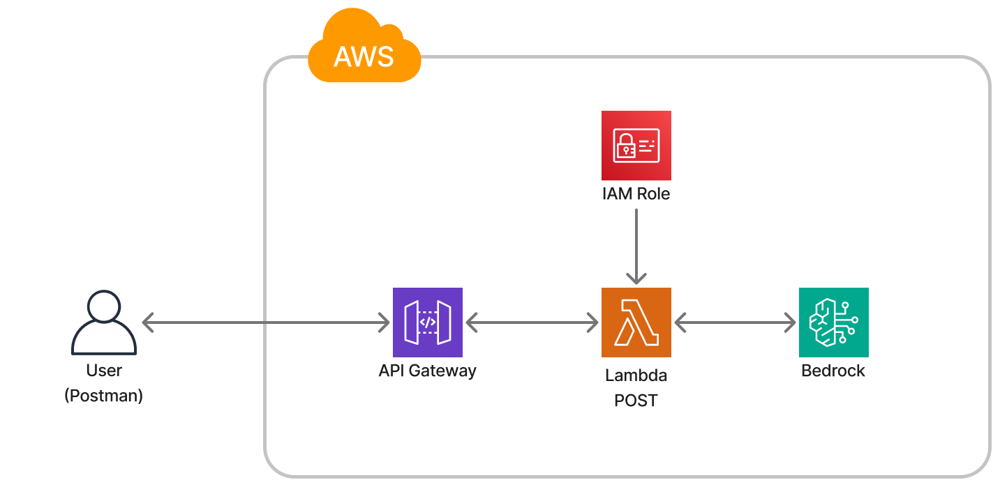
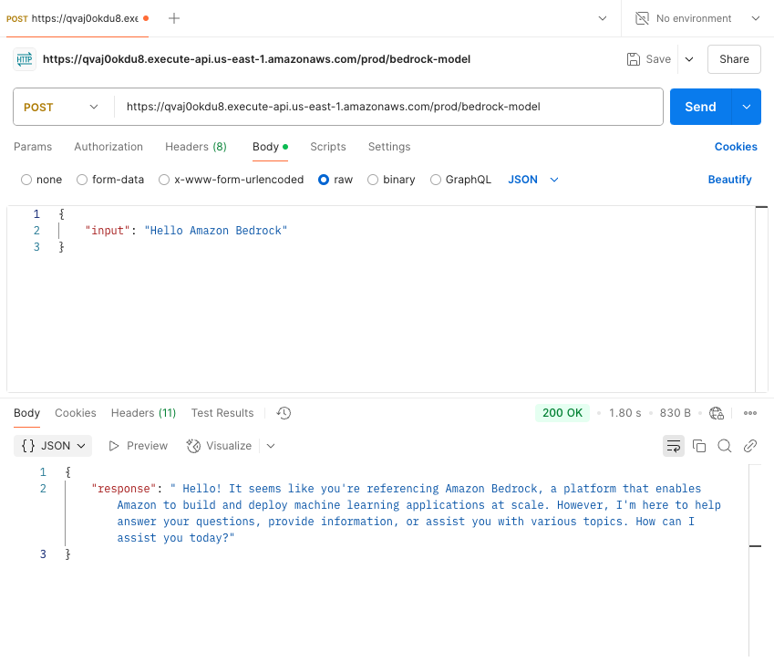

# AWS Bedrock Model Serverless Application

This project demonstrates how to build a serverless AWS application that integrates with AWS Bedrock using a Lambda function and API Gateway. The infrastructure is provisioned with Terraform and deployment is automated using GitHub Actions. This application can be integrated into any other application to add AI functionality.


## AWS Architecture


## Prerequisites

- Terraform
- AWS CLI configured with your AWS credentials (required)
- GitHub respository with Actions enabled (optional for CI/CD)
- Local Python virtual environment (recommended)

## How to run the application

```
chmod +x package_lambda.sh
./package_lambda.sh
terraform init
terraform validate
terraform plan
terraform apply -auto-approve
```

## Configuration Requirements

Examples:

```
BEDROCK_MODEL_ID="mistral.mistral-small-2402-v1:0"
BEDROCK_ENDPOINT="https://bedrock-runtime.us-east-1.amazonaws.com"
```
- [Supported foundation models in Amazon Bedrock](https://docs.aws.amazon.com/bedrock/latest/userguide/models-supported.html)
- [Amazon Bedrock endpoints](https://docs.aws.amazon.com/general/latest/gr/bedrock.html) (use Bedrock runtime APIs)

From Bedrock documentation or AWS console

## Testing with Sample Input and Output Using Postman


## Additional notes
- By using Python 3.12, there is no need to add a lambda layer as boto3 has been updated to work with the SDK and recognizes Bedrock.
- The lambda function is build specifically for Minstral. Refer to the [Inference request parameters and response fields for foundational models](https://docs.aws.amazon.com/bedrock/latest/userguide/model-parameters.html) documentation to modify your request based on the desired model.

## Resources
- [Amazon Bedrock endpoints](https://docs.aws.amazon.com/general/latest/gr/bedrock.html) (use Bedrock runtime APIs)
- [Inference request parameters and response fields for foundational models](https://docs.aws.amazon.com/bedrock/latest/userguide/model-parameters.html)
- [Identity-based policay examples for Amazon Bedrock](https://docs.aws.amazon.com/bedrock/latest/userguide/security_iam_id-based-policy-examples.html)
- [AWSLambdaBasicExecutionRole](https://docs.aws.amazon.com/aws-managed-policy/latest/reference/AWSLambdaBasicExecutionRole.html)